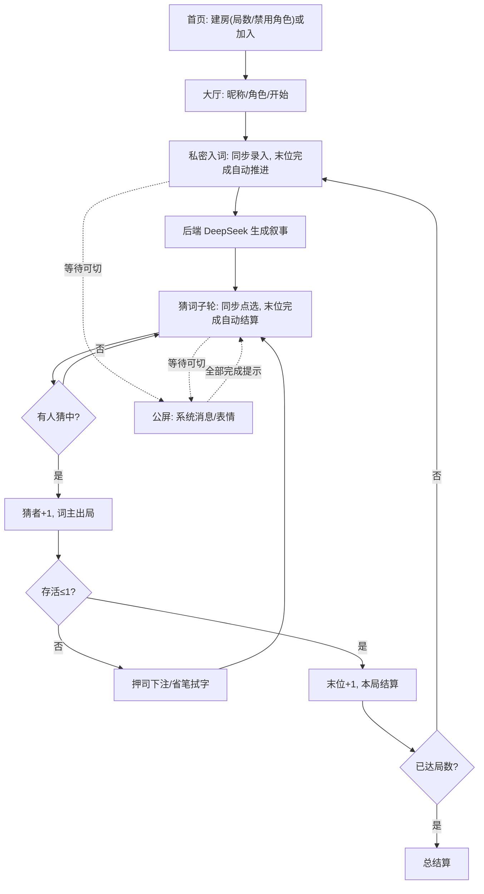

# 产品需求文档 ·《词匣》

## 1. 产品概述
《词匣》是一款 2-8 人在线社交猜词博弈网页游戏。房主建房时设定局数并可禁用部分角色，生成房间码；其他玩家用手机输码加入同一房间。每人各持一个秘密词（2-4 字），由后端调用 DeepSeek 大模型将所有词作为不可拆分单元编织成一段连贯叙事，让词语自然隐藏其中。填词与猜词均为**全员同步进行**，最后一个玩家完成即自动进入下一轮；等待期间玩家可切换到公屏查看系统消息、发表情解闷，公屏会提示"全部完成，进入下一轮"后可切回游戏界面。玩家在自己手机上点选片段猜词，猜中得分并令词主出局，无人猜中则继续，最后存活者额外得分，多局累计积分定胜负。

- 解决的问题：为分散在各自手机上的小团体提供"给词要藏、读文要找"的双向博弈玩法
- 目标用户：聚会/远程小团体（2-8 人）、桌游/派对游戏爱好者
- 价值：真在线联机 + AI 高质量隐藏叙事 + 角色技能博弈 + 同步节奏不冷场，单局 5-10 分钟

## 2. 核心功能

### 2.1 玩家角色（开局四选一，允许重复；可被房主禁用）
| 角色 | 名字释义 | 核心技能 | 猜词界面差异 |
|------|----------|----------|--------------|
| 断墨 | 笔断墨开，字字成块 | 开局将整段叙事预切分为词组单元 | 叙事以词组块呈现，点选整块即猜，无需圈选范围 |
| 省笔 | 省去闲笔，渐露真意 | 每个猜词子轮可点选移除一个"无关字" | 多一个"拭字"模式：点选非词字符将其抹去，叙事逐轮缩短 |
| 窥简 | 窥简量长，先知其度 | 开局即知每位玩家所持词的字数 | 顶部常驻词长面板（如"3 号：3 字"），其余交互同默认 |
| 押司 | 押司坐庄，下注生死 | 每次有人出局后可押注一名存活玩家 | 多一个"下注"模式：点选存活玩家下注，下轮存活 +1、被淘汰 -1，分可为负 |

### 2.2 功能模块
1. **首页/建房**：建房（设定局数 + 角色禁用）/ 加入房间（输码）
2. **大厅**：玩家列表、昵称与角色选择（禁用角色不可选）
3. **私密入词**：全员同步录入秘密词(2-4 字)，末位完成自动进入下一阶段
4. **叙事猜词**：AI 生成叙事，全员同步点选猜词，界面随角色技能而异
5. **公屏（与游戏界面可切换）**：系统消息 + 表情（冷却防刷屏）；等待时解闷；"全部完成进入下一轮"提示后切回
6. **结算**：单局淘汰回顾 + 累计积分榜，进入下一局或总结算

### 2.3 页面明细
| 页面 | 模块 | 功能描述 |
|------|------|----------|
| 首页 | 建房卡 | 设定局数(1-10)、勾选禁用角色、输入昵称后建房 |
| 首页 | 加入卡 | 输入房间码 + 昵称加入 |
| 大厅 | 房间码 | 大号房间码供分享 |
| 大厅 | 玩家列表 | 实时玩家、昵称、角色；显示房主标识与已就位人数 |
| 大厅 | 角色/昵称 | 各玩家设昵称、选角色（禁用角色置灰） |
| 大厅 | 开始 | 房主"开始游戏"（人数达标后可点） |
| 私密入词 | 录入卡 | 纸色输入框，2-4 字计数，"封匣"提交 |
| 私密入词 | 进度态 | "已封匣 N/M，等待他人…"，可切到公屏 |
| 叙事猜词页 | 卷轴卡 | 纸色长卡，叙事大号衬线，按角色交互（圈选/点块/拭字/下注）|
| 叙事猜词页 | 角色技能区 | 断墨切分、省笔拭字、窥简词长面板、押司下注 |
| 叙事猜词页 | 玩家状态条 | 存活/出局、分数、本轮完成进度 N/M |
| 叙事猜词页 | 等待态 | 已提交则显示"等待他人…"，可切公屏 |
| 公屏 | 聊天流 | 消息气泡 + 表情，系统消息居中金线（含"全部完成，进入下一轮"）|
| 公屏 | 表情栏 | 有限表情包，发送冷却 3 秒 |
| 公屏 | 切回按钮 | "返回游戏"切回游戏界面 |
| 结算页 | 单局回顾 | 词主—词语配对、出局顺序时间线 |
| 结算页 | 积分榜 | 累计积分排名，"下一局"(房主)/"总结算" |

## 3. 核心流程
1. 建房/加入：房主建房设局数 + 禁用角色 → 得房间码；他人输码加入
2. 大厅：各玩家设昵称、选角色；房主点"开始"
3. 私密入词（同步）：各人手机录入秘密词，全部提交后**自动**进入下一阶段；等待时可切公屏
4. 故事生成：后端调 DeepSeek 生成约「10 + 人数×10」字连贯叙事，下发全体
5. 猜词子轮（同步）：存活玩家各点选一猜并提交；末位完成**自动**结算
6. 结算子轮：猜中→猜者 +1，词主出局；多人同猜中同一词均生效
7. 终局判定：存活仅剩 1 人 → 该玩家 +1，本局结束；无人猜中 → 下一子轮
8. 公屏同步提示"全部完成，进入下一轮"；玩家可切回游戏界面
9. 押司每次出局后下注；省笔每子轮拭一字；断墨开局预切分；窥简开局知词长
10. 达设定局数 → 总结算积分榜

## 4. 用户界面设计

### 4.1 设计风格
- **主题**：东方文房 / 水墨暗卷 + 朱砂金箔点缀，呼应"词匣 / 墨 / 简"意象
- **配色**：墨黑底 `#0E0D0B`，纸色 `#EDE4D3`，朱砂 `#C0392B`，金箔 `#C9A24B`，靛青 `#2C5F6F`
- **字体**：标题 Ma Shan Zheng / ZCOOL XiaoWei，正文 Noto Serif SC
- **按钮**：朱砂印章式主按钮、金线描边次按钮，tap 浮起 + 墨晕
- **布局**：移动端优先单列竖排；游戏阶段顶部 Tab 切换"游戏 / 公屏"
- **氛围**：纸纹噪点、墨晕扩散、点选涟漪、卷轴展开动效

### 4.2 页面设计概览（移动端优先）
| 页面 | 模块 | UI 元素 |
|------|------|---------|
| 首页 | 标题区 | 大字"词匣"+ 副标题，水墨背景 |
| 首页 | 建房卡 | 局数选择、角色禁用勾选、昵称、"建房" |
| 首页 | 加入卡 | 房间码输入、昵称、"加入" |
| 大厅 | 房间码卡 | 大号房间码 + 复制 |
| 大厅 | 角色选择 | 四张角色卡（禁用置灰），高亮当前 |
| 私密入词 | 录入卡 | 纸色输入框，字数计数，"封匣" |
| 叙事猜词页 | 顶部 Tab | "游戏 | 公屏" 切换，公屏有红点提示新消息 |
| 叙事猜词页 | 卷轴卡 | 叙事大号衬线，按角色交互 |
| 叙事猜词页 | 技能区/状态条 | 角色技能 + 完成进度 N/M |
| 公屏 | 聊天流 | 消息气泡 + 表情，系统消息金线居中 |
| 结算页 | 回顾/积分榜 | 词主—词语配对 + 排名 |

### 4.3 响应式
移动端优先（≤480px 单列），平板/桌面居中加宽；触摸热区最小 44px。

### 4.4 3D 场景
不适用（2D 水墨界面）。
