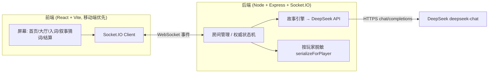
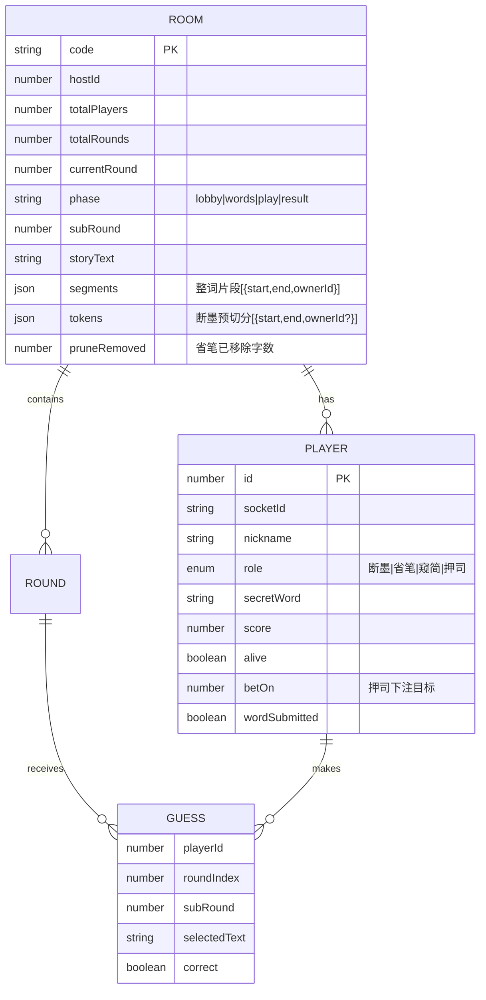

# 技术架构文档 ·《词匣》

## 1. 架构设计
前后端分离的在线联机架构。前端 React 单页（移动端优先），后端 Node + Express + Socket.IO 负责房间管理、状态机权威同步与 DeepSeek 故事生成。服务器为唯一权威（source of truth），持有全部秘密词；下发时按玩家视角脱敏（不暴露他人秘密词）。



## 2. 技术说明
- **前端**：React@18 + tailwindcss@3 + vite（移动端优先，Socket.IO Client）
- **后端**：Node.js + Express@4 + socket.io@4，内存态房间（无数据库）
- **AI**：DeepSeek `deepseek-chat`，OpenAI 兼容接口，服务端 `openai` SDK（`baseURL: https://api.deepseek.com`），Key 走环境变量 `DEEPSEEK_API_KEY`（存 `server/.env`，已 gitignore）
- **初始化工具**：vite-init（前端）、npm init（后端）
- **状态管理**：前端 Context + useReducer 维护本地视图；后端 `Map<roomCode, RoomState>` 维护权威状态，变更后向房间广播 `room:state`（脱敏视图按 socket 分别下发）
- **路由**：前端无路由库，`screen` 状态字段驱动；后端仅 Express 静态托管 + Socket.IO
- **字体**：Google Fonts 引入 Ma Shan Zheng / ZCOOL XiaoWei / Noto Serif SC

## 3. 屏幕定义（前端 screen 状态）
| screen 值 | 用途 |
|-----------|------|
| `home` | 首页：建房 / 加入房间 |
| `lobby` | 大厅：房间码、玩家列表、昵称/角色、房主配置 |
| `words` | 私密入词：各自录入秘密词 |
| `play` | 叙事猜词：叙事卷轴、点选猜词、技能、玩家状态、公屏 |
| `result` | 结算：单局回顾 + 累计积分榜 / 总结算 |

## 4. Socket.IO 事件定义

**Client → Server**
| 事件 | 载荷 | 说明 |
|------|------|------|
| `room:create` | `{ nickname, totalRounds, disabledRoles }` | 建房（设局数+禁用角色），返回 `roomCode` + `playerId` |
| `room:join` | `{ roomCode, nickname }` | 加入，返回 `playerId` 或 `error` |
| `lobby:profile` | `{ nickname, role }` | 设置昵称/角色（禁用角色服务端拒绝）|
| `lobby:start` | `{}` | 房主开始（人数达标后）|
| `words:submit` | `{ word }` | 提交秘密词（2-4 字） |
| `guess:submit` | `{ start, end }` | 提交猜词（字符区间）|
| `guess:submitToken` | `{ tokenIndex }` | 断墨：按预切分词组提交 |
| `skill:prune` | `{ charIndex }` | 省笔：移除一个无关字 |
| `skill:bet` | `{ targetPlayerId }` | 押司：下注存活玩家 |
| `chat:emoji` | `{ emoji }` | 公屏表情（3s 冷却） |
| `round:next` | `{}` | 房主：下一局 |

**Server → Client**
| 事件 | 载荷 | 说明 |
|------|------|------|
| `room:state` | `PlayerView` | 按玩家脱敏的完整视图（权威同步）|
| `chat:message` | `ChatMessage` | 新增公屏消息 |
| `error` | `{ message }` | 错误提示 |

## 5. 服务器架构图
不适用（无传统 Controller/Service/Repository 分层；Socket.IO 事件处理 + 内存房间 + AI 调用单进程）。

## 6. 数据模型

### 6.1 数据模型定义



### 6.2 核心 TypeScript 定义

```ts
type Role = '断墨' | '省笔' | '窥简' | '押司';

interface Player {
  id: number;
  socketId: string;
  nickname: string;
  role: Role;
  secretWord: string;      // 仅服务器持有，不下发他人
  score: number;
  alive: boolean;
  betOn?: number;
  wordSubmitted: boolean;
}

interface Segment { start: number; end: number; ownerId?: number; }

interface RoomState {
  code: string;
  hostId: number;
  maxPlayers: number;           // 固定 8
  totalRounds: number;          // 建房时设定
  disabledRoles: Role[];        // 建房时禁用的角色
  currentRound: number;
  phase: 'lobby' | 'words' | 'play' | 'result';
  subRound: number;
  storyText: string;
  segments: Segment[];          // 玩家整词位置（脱敏后 ownerId 仅自己可见）
  tokens: Segment[];            // 断墨预切分（通用，所有人可见）
  pruneRemoved: number;
  players: Player[];
  pendingGuesses: Record<number, { start: number; end: number } | { tokenIndex: number }>;
  pendingPrune: Record<number, number>;  // 省笔本子轮已拭字标记
  eliminationOrder: number[];
  chat: ChatMessage[];
}

// 下发给单个玩家的脱敏视图
interface PlayerView {
  screen: 'home' | 'lobby' | 'words' | 'play' | 'result';
  roomCode: string;
  myId: number;
  mySecretWord: string;          // 仅自己词
  myRole: Role;
  disabledRoles: Role[];         // 禁用角色
  players: { id: number; nickname: string; role: Role; score: number; alive: boolean; wordSubmitted: boolean; done: boolean }[];
  totalRounds: number; currentRound: number; subRound: number; phase: string;
  storyText: string;
  tokens: Segment[];             // 断墨视图
  segmentHints: { ownerId: number; length: number }[]; // 窥简视图：各玩家词长
  pruneRemoved: number;
  isHost: boolean;
  completion: { done: number; total: number };  // 本阶段完成进度（末位完成自动推进）
  eliminationOrder: number[];
  revealedWords?: { ownerId: number; word: string }[];  // 仅 result 阶段
  chat: ChatMessage[];
}
```

### 6.3 DeepSeek 故事生成契约
- **Prompt 要点**：给定 N 个玩家词（每个 2-4 字），要求生成一段连贯、完整、逻辑清晰的中文叙事；每个玩家词必须**作为不可拆分整词**恰好出现一次，不得在别处重复出现或拆分；目标字数约 `10 + N×10` 字；叙事需自然隐藏这些词，使其不突兀；**只返回叙事正文**。
- **定位**：服务端拿到正文后，对每个玩家词做字符串查找，确定 `[start,end)` 区间写入 `segments`；若某词未找到或多次出现，提示模型重试一次，仍失败则该词降级为"未嵌入"（该玩家本局无法被猜中出局，结算时按存活处理）。
- **脱敏**：`segments` 中的 `ownerId` 仅对该词主可见，他人只见无主片段。
- **环境变量**：`DEEPSEEK_API_KEY`（`server/.env`），`PORT`（默认 4000）。

### 6.4 初始化与存档
- 无 DDL / 无数据库；房间状态存内存，进程重启即清空（派对游戏可接受）
- 客户端用 `localStorage` 记录 `{roomCode, playerId}` 以支持断线重连（重连后服务端按 socket 恢复 `socketId`）

### 6.5 同步推进与公屏提示
- **同步动作**：私密入词与猜词子轮均为全员并行；服务端在每名玩家提交时更新其 `done` 标记并广播进度。
- **自动推进**：当本阶段所有应参与的存活玩家 `done` 为真时，服务端**自动**结算/推进，无需房主按钮：
  - 入词阶段全部 `wordSubmitted` → 触发 DeepSeek 生成叙事 → 进入 `play`
  - 猜词子轮全部存活玩家已提交 → 结算猜中/出局 → 决定下一子轮或本局结束
- **公屏系统消息**（`ChatMessage.type='system'`）：
  - `"已封匣 {done}/{total}，等待他人…"`（入词进度）
  - `"全部已封匣，正在研墨成文…"`（开始生成叙事）
  - `"第 {subRound} 轮猜词 {done}/{total}"`（猜词进度）
  - `"全部完成，进入下一轮"`（自动推进时，提示玩家可切回游戏界面）
  - `"{nickname} 猜中了 {target} 的词，{target} 出局"`（结算）
- **界面切换**：`play` 阶段前端用本地 `tab: 'game' | 'chat'` 切换；公屏有未读时游戏 Tab 显示红点；收到"全部完成，进入下一轮"后引导切回 `game`。
